# 후속 재평가 및 범용 의사결정 엔진 리팩토링 개발상세지시서

- 작성일: 2026-05-09 17:58:01
- 대상 프로젝트: `/Users/switch/Development/Web/life_simulator`
- 목적: 현재 Life Simulator 흐름을 유지하면서, 후속 입력 기반 재평가 기능과 범용 의사결정 엔진으로 확장 가능한 구조를 구현한다.
- 실행 원칙: 구현자는 큰 이슈가 없으면 중단하지 말고 끝까지 진행한다. 필요한 경우 단계별로 테스트 후 커밋한다.

## 1. 최종 목표

현재 서비스는 사용자의 기본 정보, 고민 상황, A/B 선택지를 입력받아 추천 결과를 생성한다.

이번 리팩토링의 목표는 두 가지다.

1. 첫 결과 이후 `각 선택지의 최악의 경우`와 `되돌릴 수 있는 조건`을 추가 입력받아 전체 엔진을 다시 실행한다.
2. 향후 B2C/B2B 도메인별로 조금 다른 입력 포맷이 들어와도, 공통 의사결정 엔진 계약으로 정규화해 같은 평가/추천 흐름을 사용할 수 있게 만든다.

중요한 방향은 `부분 이어가기`가 아니라 `기본 정보는 승계하고 추가 정보만 붙여 전체 재실행`이다. 이렇게 해야 기존 엔진의 라우팅, 리스크 평가, 어드바이저, 가드레일 흐름을 그대로 활용할 수 있고 복잡도가 과도하게 올라가지 않는다.

## 2. 제품/UX 결정

### 2.1 후속 재평가 UX

첫 실행 결과를 지우지 않는다. 기존 결과 아래에 후속 입력 패널을 추가한다.

사용자가 첫 결과를 받은 뒤 `유의할 점`과 `다음 제안`을 확인한다. 그 아래에 `추가 검토하기` 패널을 보여준다.

후속 입력 패널은 아래 4개 입력만 받는다.

- A안의 최악의 경우
- A안을 되돌릴 수 있는 조건
- B안의 최악의 경우
- B안을 되돌릴 수 있는 조건

나이, 직업, 리스크 성향, 우선순위, 기존 고민 내용, A/B 선택지명은 다시 입력하지 않는다. 프론트엔드가 직전 요청 값을 그대로 승계해서 새 요청을 만든다.

후속 실행 결과는 `v2`로 표시하고 최신 결과를 기본 화면의 주 결과로 보여준다. 이전 결과 `v1`은 접을 수 있는 비교 이력으로 남긴다.

재평가 완료 후에는 간단한 변화 요약 카드를 보여준다.

- 추천안이 바뀌었는지
- 신뢰도 또는 점수가 의미 있게 변했는지
- 주요 리스크 판단이 바뀌었는지
- 실행 모드 또는 가드레일 모드가 바뀌었는지

초기 구현에서 변화 요약은 LLM을 다시 호출하지 말고 응답 필드 기반의 결정적 비교로 만든다. LLM 기반 비교 해설은 후속 개선 사항으로 둔다.

### 2.2 왜 기존 결과 유지 방식인가

기존 결과를 초기화하고 처음부터 다시 입력하는 방식은 사용자에게 같은 정보를 다시 요구하게 된다. 이 기능의 핵심은 첫 결과를 보고 부족한 정보를 보완하는 것이므로, 이전 결과와 새 결과를 나란히 이해할 수 있어야 한다.

따라서 UX 원칙은 `기존 결과 보존 + 추가 정보 기반 새 실행 + 최신 결과 강조`다.

## 3. 아키텍처 결정

### 3.1 전체 재실행

후속 입력은 기존 엔진 상태를 이어받아 중간 단계부터 재개하지 않는다. 새 요청을 만들어 전체 파이프라인을 다시 실행한다.

이 방식의 장점은 다음과 같다.

- 현재 `planner -> scenario -> risk -> advisor -> reflection` 흐름을 그대로 재사용한다.
- 중간 스테이지 캐시, 상태 복원, 부분 프롬프트 재생성 로직이 필요 없다.
- 입력 정보가 늘어났을 때 모든 단계가 같은 컨텍스트를 보고 판단한다.
- 엔진을 별도 서비스로 분리할 때도 stateless API로 유지하기 쉽다.

단점은 LLM 호출 비용이 다시 발생한다는 점이다. 현재 단계에서는 구조 단순성과 정확성을 우선한다.

### 3.2 범용 엔진 계약

현재 코드에는 `GenericDecisionRequest`와 Life 도메인 매퍼가 이미 존재한다. 그러나 실제 실행 흐름은 아직 Life 전용 요청과 Life 전용 스테이지에 강하게 묶여 있다.

이번 작업에서는 즉시 완전한 범용 엔드포인트까지 강제하지 않는다. 대신 아래 원칙을 지켜 향후 분리를 막지 않도록 만든다.

- 프론트엔드 입력 포맷은 백엔드 Life API 계약으로 보낸다.
- Life API 요청은 백엔드에서 공통 `GenericDecisionRequest`로 정규화할 수 있어야 한다.
- 후속 입력은 Life 전용 필드에만 갇히지 않고 공통 option attribute로 매핑되어야 한다.
- 엔진 실행부는 점진적으로 `GenericDecisionRequest`를 기준으로 입력을 읽도록 이동한다.
- 현재 `/api/simulate` 응답 형태는 깨지지 않는다.

최종 방향은 아래 구조다.

```mermaid
flowchart LR
  UI["Frontend Life UI"] --> LifeApi["/api/simulate"]
  LifeApi --> LifeAdapter["Life Request Adapter"]
  LifeAdapter --> GenericRequest["GenericDecisionRequest"]
  GenericRequest --> Engine["Decision Engine"]
  Engine --> GenericResult["GenericDecisionResult"]
  GenericResult --> LifeResponseAdapter["Life Response Adapter"]
  LifeResponseAdapter --> UIResponse["SimulationResponse"]
```



초기 구현에서는 `GenericDecisionResult`가 완전히 분리되어 있지 않더라도, 요청 정규화와 stage input 생성 경계를 명확히 해야 한다.

## 4. 요청 계약

### 4.1 현재 Life 요청 확장

기존 요청 형태를 깨지 말고 optional 필드만 추가한다.

권장 백엔드/프론트엔드 요청 형태는 다음과 같다.

```json
{
  "userProfile": {
    "age": "30대",
    "job": "개발자",
    "risk": "balanced",
    "priority": "growth"
  },
  "decision": {
    "optionA": "현재 직장 유지",
    "optionB": "이직 준비",
    "context": "커리어 성장과 안정성 사이에서 고민 중",
    "optionDetails": {
      "A": {
        "worstCase": "현재 직장에 남았는데 성장 기회가 계속 줄어든다.",
        "rollbackCondition": "6개월 안에 역할 확장 또는 연봉 조정이 없으면 이직 준비로 전환한다."
      },
      "B": {
        "worstCase": "이직했지만 업무 강도와 문화가 맞지 않아 후회한다.",
        "rollbackCondition": "수습 기간 또는 3개월 안에 조직 적합성이 낮으면 이전 네트워크를 통해 재탐색한다."
      }
    }
  },
  "reevaluation": {
    "reason": "option_followup",
    "iteration": 2,
    "previousRequestId": "optional-client-generated-id"
  }
}
```

필드명은 Java/TypeScript 양쪽에서 camelCase로 통일한다.

`optionDetails`와 `reevaluation`은 optional이다. 첫 실행 요청은 기존처럼 동작해야 한다.

### 4.2 공통 계약 매핑

Life 요청은 공통 계약으로 아래처럼 매핑한다.

```json
{
  "subject": "life_decision",
  "question": "커리어 성장과 안정성 사이에서 고민 중",
  "context": {
    "age": "30대",
    "job": "개발자",
    "risk": "balanced",
    "priority": "growth"
  },
  "options": [
    {
      "id": "A",
      "label": "현재 직장 유지",
      "attributes": {
        "worstCase": "현재 직장에 남았는데 성장 기회가 계속 줄어든다.",
        "rollbackCondition": "6개월 안에 역할 확장 또는 연봉 조정이 없으면 이직 준비로 전환한다."
      }
    },
    {
      "id": "B",
      "label": "이직 준비",
      "attributes": {
        "worstCase": "이직했지만 업무 강도와 문화가 맞지 않아 후회한다.",
        "rollbackCondition": "수습 기간 또는 3개월 안에 조직 적합성이 낮으면 이전 네트워크를 통해 재탐색한다."
      }
    }
  ],
  "hints": {
    "reevaluationReason": "option_followup",
    "iteration": 2
  }
}
```

향후 다른 도메인은 자기 입력 포맷을 받아도 `options[].attributes.worstCase`, `options[].attributes.rollbackCondition`으로 정규화하면 같은 엔진에서 사용할 수 있어야 한다.

## 5. 백엔드 구현 계획

### 5.1 요청 DTO 확장

대상 후보 파일:

- `backend/src/main/java/com/lifesimulator/backend/simulation/SimulationRequest.java`
- `backend/src/main/java/com/lifesimulator/backend/simulation/SimulationController.java`
- `backend/src/main/java/com/lifesimulator/backend/engine/domain/life/mapping/LifeRequestToGenericDecisionMapper.java`
- `backend/src/test/java/com/lifesimulator/backend/...`

작업 내용:

- `SimulationRequest.Decision` 또는 동등한 decision DTO에 `optionDetails` optional 필드를 추가한다.
- `OptionDetails` record/class를 추가한다.
- A/B 각각 `worstCase`, `rollbackCondition` optional 문자열을 받는다.
- top-level 또는 request-level에 `ReevaluationMetadata` optional 필드를 추가한다.
- `ReevaluationMetadata`는 `reason`, `iteration`, `previousRequestId`를 가진다.
- 기존 JSON 요청은 변경 없이 역직렬화되어야 한다.
- null-safe 접근자를 제공하거나 매퍼에서 null을 안전하게 처리한다.

검증 규칙:

- 첫 실행에서는 `optionDetails`가 없어도 정상이다.
- 재평가 요청에서는 4개 필드 중 일부가 비어도 서버가 400을 내지 않는다. 사용자가 아직 모르는 항목을 비울 수 있어야 한다.
- 단, 각 문자열은 기존 입력 제한과 동일한 수준의 trim/length 제한을 적용한다.
- 너무 긴 텍스트는 validation error 또는 안전한 truncate 중 하나로 처리한다. 기존 프로젝트의 validation 방식에 맞춘다.

### 5.2 GenericDecisionRequest 매핑 보강

대상 파일:

- `backend/src/main/java/com/lifesimulator/backend/engine/contract/GenericDecisionRequest.java`
- `backend/src/main/java/com/lifesimulator/backend/engine/domain/life/mapping/LifeRequestToGenericDecisionMapper.java`

작업 내용:

- 기존 `GenericDecisionRequest`에 option attributes를 담을 구조가 없다면 추가한다.
- 이미 `DecisionOption` 또는 유사 구조가 있으면 거기에 `Map<String, Object>` 또는 typed attributes를 추가한다.
- typed record를 새로 만들 경우 범용성을 해치지 않도록 `Map<String, String>` 또는 `Map<String, Object>`가 더 적합하다.
- Life 매퍼에서 `decision.optionDetails.A.worstCase`를 option A attributes의 `worstCase`로 넣는다.
- Life 매퍼에서 `decision.optionDetails.A.rollbackCondition`을 option A attributes의 `rollbackCondition`으로 넣는다.
- `reevaluation.reason`, `iteration`은 `hints` 또는 `metadata`에 넣는다.
- 매퍼 테스트를 추가해 후속 입력이 공통 계약에 보존되는지 검증한다.

주의:

- 공통 계약 필드명은 도메인에 과하게 종속되지 않게 한다.
- `worstCase`, `rollbackCondition`은 다른 도메인에서도 사용할 수 있는 의사결정 속성이므로 범용 option attribute로 둔다.

### 5.3 Stage input 생성 보강

대상 파일:

- `backend/src/main/java/com/lifesimulator/backend/engine/domain/life/stage/LifeStageInputMapper.java`
- `backend/src/main/java/com/lifesimulator/backend/simulation/StageExecutionService.java`
- `backend/src/main/resources/prompts/life/*.md`

작업 내용:

- 각 stage에 전달되는 입력 JSON에 `optionDetails` 또는 normalized `options[].attributes`가 포함되도록 한다.
- `planner`, `scenario`, `risk`, `advisor`, `reflection` 단계가 후속 정보를 볼 수 있어야 한다.
- 프롬프트는 후속 입력이 있을 때 다음을 반영하도록 수정한다.
- 최악의 경우는 리스크 평가에서 더 크게 반영한다.
- 되돌릴 수 있는 조건은 추천안의 실행 가능성, 손실 제한, reversibility 판단에 반영한다.
- 후속 입력이 없는 첫 실행에서는 기존 출력 품질과 형식이 유지되어야 한다.

프롬프트 수정 원칙:

- 출력 JSON shape을 변경하지 않는다.
- 새 필드는 입력 컨텍스트로만 추가한다.
- 응답의 `reflection.user_summary.suggested_actions`는 후속 입력이 이미 들어온 경우 같은 질문을 반복하지 않도록 한다.
- 후속 입력이 없는 경우에는 지금처럼 `각 선택지의 최악의 경우와 되돌릴 수 있는 조건을 적어보세요.` 제안이 나올 수 있다.

### 5.4 Fallback/seed 응답 보정

대상 파일:

- `backend/src/main/java/com/lifesimulator/backend/engine/domain/life/response/LifeStageSeedFactory.java`
- 관련 response factory 테스트

작업 내용:

- mock/fallback 결과에서도 후속 입력 여부를 고려한다.
- 후속 입력이 없는 경우에는 기존 suggested action을 유지해도 된다.
- 후속 입력이 있는 경우에는 다음 제안이 `추가 정보 입력` 반복이 아니라 `실행 전 체크포인트`나 `실험 기간 설정`으로 바뀌도록 한다.

이 작업은 필수 기능은 아니지만 로컬 mock 테스트의 UX 일관성을 위해 같이 처리한다.

### 5.5 범용 엔진 경계 강화

대상 파일:

- `backend/src/main/java/com/lifesimulator/backend/engine/DecisionEngine.java`
- `backend/src/main/java/com/lifesimulator/backend/simulation/SimulationService.java`
- `backend/src/main/java/com/lifesimulator/backend/engine/domain/life/mapping/*`

작업 내용:

- `SimulationService`가 Life 요청만 직접 처리하더라도, 내부 초반에 `GenericDecisionRequest`를 생성해 로그/테스트 가능한 구조로 만든다.
- 가능하면 stage input mapper가 Life request만 보지 않고 `GenericDecisionRequest` 또는 그로부터 파생된 domain context를 함께 받도록 점진 변경한다.
- 한 번에 전체 엔진 타입을 뒤집지 않는다. 기존 API 안정성이 우선이다.
- 새 도메인이 들어올 때 추가해야 하는 파일이 `DomainRequestAdapter`, `PromptPack`, `ResponseAdapter`로 제한되도록 책임 경계를 문서화한다.

비목표:

- 이번 작업에서 완전한 `/api/decision-engine/generic` 공개 엔드포인트를 만들 필요는 없다.
- DB 저장, 사용자 계정, 결과 히스토리 영구 저장은 이번 범위가 아니다.
- 멀티턴 대화형 엔진은 이번 범위가 아니다.

## 6. 프론트엔드 구현 계획

### 6.1 상태 모델 변경

대상 파일:

- `frontend/src/hooks/use-simulation-submit.ts`
- `frontend/src/lib/simulation/form.ts`
- `frontend/src/lib/types.ts`
- 필요 시 신규 파일 `frontend/src/lib/simulation/result-version.ts`

현재 훅은 단일 `result`만 관리한다. 후속 재평가를 위해 결과 버전 목록을 관리해야 한다.

권장 타입:

```ts
export type SimulationResultVersion = {
  id: string;
  label: string;
  request: SimulationRequest;
  response: SimulationResponse;
  createdAt: string;
  parentId?: string;
  reevaluationReason?: "option_followup";
};
```

권장 상태:

```ts
{
  versions: SimulationResultVersion[];
  latest: SimulationResultVersion | null;
  isSubmitting: boolean;
  progress: SimulationProgressState;
  error: string | null;
}
```

작업 내용:

- 첫 실행 성공 시 `versions = [v1]`, `latest = v1`.
- 후속 실행 성공 시 기존 versions 뒤에 `v2`를 추가하고 `latest = v2`.
- 첫 입력 폼을 다시 제출하면 새 의사결정으로 간주해 versions를 초기화한다.
- 후속 실행 중에도 기존 결과는 화면에 남긴다.
- 후속 실행 실패 시 기존 latest는 유지하고 error만 표시한다.

### 6.2 요청 생성 함수 분리

대상 파일:

- `frontend/src/lib/simulation/form.ts`
- 필요 시 신규 파일 `frontend/src/lib/simulation/reevaluation.ts`

작업 내용:

- 기존 `buildPayload`는 첫 실행 요청을 그대로 만들게 유지한다.
- 후속 실행 요청을 만드는 `buildReevaluationPayload`를 추가한다.
- `buildReevaluationPayload`는 이전 request를 base로 복사하고 `decision.optionDetails`, `reevaluation`만 추가한다.
- base request를 직접 mutate하지 않는다.
- 비어 있는 후속 입력은 trim 후 빈 문자열 또는 undefined로 통일한다. 서버와 맞춘다.

권장 함수 시그니처:

```ts
export function buildReevaluationPayload(
  previousRequest: SimulationRequest,
  followup: OptionFollowupState,
  iteration: number,
  previousRequestId?: string,
): SimulationRequest;
```

### 6.3 후속 입력 컴포넌트 추가

신규 파일 권장:

- `frontend/src/components/simulation/followup-reevaluation-panel.tsx`

컴포넌트 책임:

- 후속 입력 4개를 렌더링한다.
- 이전 요청의 A/B 선택지명을 제목에 보여준다.
- 제출 버튼은 `이 정보로 다시 평가하기`로 표시한다.
- 제출 중에는 비활성화하고 진행 중 상태를 표시한다.
- 첫 결과가 없으면 렌더링하지 않는다.

UI 문구 예시:

- 제목: `결과를 더 정확하게 만들기`
- 설명: `기본 정보는 그대로 두고, 각 선택지의 최악의 경우와 되돌릴 수 있는 조건만 추가해 전체 판단을 다시 실행합니다.`
- A안 섹션: `A안: {optionA}`
- B안 섹션: `B안: {optionB}`

주의:

- 이 컴포넌트는 `simulation-page.tsx` 안에 길게 직접 구현하지 않는다.
- 기존 페이지 파일이 커지고 있으므로 새 컴포넌트로 분리해 파일별 라인 수를 관리한다.

### 6.4 결과 버전 비교 컴포넌트 추가

신규 파일 권장:

- `frontend/src/components/simulation/result-version-summary.tsx`
- 필요 시 `frontend/src/lib/simulation/compare-results.ts`

컴포넌트 책임:

- latest와 previous를 받아 변화 요약을 표시한다.
- 추천안 변경 여부를 표시한다.
- confidence/score 필드가 있으면 변화량을 표시한다.
- guardrail/final mode가 있으면 변화 여부를 표시한다.
- 이전 결과를 접고 펼칠 수 있게 한다.

주의:

- 응답 필드가 없거나 모델별로 다를 수 있으므로 optional chaining을 사용한다.
- 비교할 수 없는 값은 표시하지 않는다.
- 비교 요약 때문에 백엔드 응답 shape을 바꾸지 않는다.

### 6.5 SimulationPage 조립

대상 파일:

- `frontend/src/components/simulation/simulation-page.tsx`

작업 내용:

- 기존 첫 실행 폼과 결과 렌더링은 최대한 유지한다.
- `ReflectionCard` 아래에 `FollowupReevaluationPanel`을 배치한다.
- 후속 실행 완료 후 최신 결과 영역이 v2를 보여주도록 연결한다.
- v1 결과는 `ResultVersionSummary` 또는 별도 history 영역에서 접을 수 있게 한다.
- 첫 실행 폼을 다시 수정하고 제출하면 새 문제로 판단해 결과 이력을 초기화한다.

파일 크기 관리:

- `simulation-page.tsx`가 700라인에 가까워지거나 넘으면 새 훅/컴포넌트로 분리한다.
- 후속 폼 로직, 비교 로직, request build 로직은 페이지 파일에 직접 넣지 않는다.

## 7. 테스트 계획

### 7.1 백엔드 단위/통합 테스트

필수 테스트:

- 기존 첫 실행 요청이 그대로 통과한다.
- `optionDetails`가 포함된 요청이 200 응답을 반환한다.
- `LifeRequestToGenericDecisionMapper`가 A/B 후속 입력을 `GenericDecisionRequest.options[].attributes`로 보존한다.
- `reevaluation` metadata가 hints 또는 metadata에 보존된다.
- 후속 입력이 없는 경우 stage input에 null pointer가 발생하지 않는다.
- 후속 입력이 있는 경우 stage input JSON에 worstCase/rollbackCondition이 포함된다.

명령:

```bash
cd backend && ./mvnw test
```

### 7.2 프론트엔드 타입/빌드 검증

필수 검증:

- TypeScript 타입 체크 통과
- Vite build 통과
- 후속 입력 컴포넌트 타입 안정성 확인
- `SimulationRequest` 확장 후 기존 호출부 타입 오류 없음

명령:

```bash
cd frontend && npm run typecheck
cd frontend && npm run build
```

### 7.3 로컬 스모크 테스트

로컬 기본 LLM provider는 `codex`다. mock mode는 삭제하지 않지만 기본값으로 사용하지 않는다.

실행:

```bash
cd backend && ./mvnw spring-boot:run
cd frontend && npm run dev
```

브라우저 검증:

- 첫 실행 폼을 입력하고 결과를 생성한다.
- 결과 하단에 후속 입력 패널이 표시된다.
- 4개 후속 입력을 채운다.
- `이 정보로 다시 평가하기`를 누른다.
- 기존 결과가 사라지지 않고, 새 결과가 v2 최신 결과로 표시된다.
- v1 결과를 접고 펼칠 수 있다.
- 변화 요약 카드가 표시된다.
- 콘솔 에러가 없어야 한다.

API 검증:

- 기존 요청 JSON으로 `/api/simulate` 호출이 성공한다.
- `decision.optionDetails`와 `reevaluation`이 있는 JSON으로 `/api/simulate` 호출이 성공한다.
- mock provider로도 같은 request shape이 실패하지 않는다.

## 8. 커밋 계획

구현자가 실제 개발을 진행할 때는 큰 이슈가 없으면 아래 단위로 커밋한다.

1. 백엔드 요청 계약과 매퍼 테스트
2. 백엔드 stage input/prompt/fallback 반영
3. 프론트엔드 후속 요청 생성과 상태 모델
4. 프론트엔드 후속 입력 UI와 결과 버전 비교 UI
5. 전체 검증 후 정리 커밋

커밋 전 확인:

- 관련 테스트 또는 타입 체크가 통과했는지 확인한다.
- docs 파일은 사용자가 별도로 지시하지 않으면 코드 구현 커밋에 포함하지 않는다.
- 기존에 작업자가 만들지 않은 변경은 되돌리지 않는다.
- `git status --short`로 의도하지 않은 파일 변경을 확인한다.

커밋 메시지 예시:

```text
feat: support follow-up reevaluation requests
refactor: preserve option follow-up details in generic decision mapping
feat: add versioned simulation result UI
```

## 9. 중단하지 않는 진행 규칙

구현자는 아래 상황이 아니면 사용자에게 질문하지 말고 합리적인 기본값으로 끝까지 진행한다.

중단해야 하는 경우:

- 기존 공개 API 응답 shape을 깨야만 구현 가능한 경우
- 사용자 데이터 삭제, DB 스키마 파괴, 마이그레이션 손실 위험이 있는 경우
- 현재 작업과 직접 충돌하는 사용자 변경이 같은 파일에 새로 발생한 경우
- Codex CLI 인증, OpenAI API key, 외부 네트워크 문제 때문에 실제 동작 검증이 불가능하고 mock으로도 대체할 수 없는 경우
- 테스트 실패 원인이 기능 결함인지 기존 환경 문제인지 판단할 수 없는 경우

중단하지 말아야 하는 경우:

- 파일을 나눠야 하는 정도의 구조 변경
- 타입 오류를 해결하기 위한 local refactor
- 프롬프트 문구 보정
- 테스트 fixture 업데이트
- mock provider 결과 문구 보정
- UI 컴포넌트 분리
- 기존 파일 라인 수를 줄이기 위한 helper 추출

중간에 막히면 우회 기준은 다음 순서다.

1. 기존 API shape 유지
2. 전체 재실행 방식 유지
3. 후속 입력은 optional로 유지
4. GenericDecisionRequest로 정보가 보존되도록 유지
5. UI는 최신 결과 중심, 이전 결과 보존 원칙 유지

## 10. 파일 크기 및 책임 분리 규칙

파일별 라인 수는 가능하면 500라인 이하, 최대 700라인 이하로 유지한다. 불가피한 경우만 예외로 둔다.

분리 기준:

- Controller는 HTTP 입출력만 담당한다.
- Service는 실행 흐름 orchestration만 담당한다.
- Mapper는 요청/응답 변환만 담당한다.
- Prompt repository와 stage input mapper는 프롬프트 입력 구성만 담당한다.
- React page는 화면 조립만 담당한다.
- 후속 폼, 비교 카드, 결과 이력은 별도 컴포넌트로 분리한다.
- 타입과 순수 비교 로직은 `lib` 또는 hook으로 분리한다.

피해야 할 구조:

- `simulation-page.tsx`에 후속 폼 상태, 비교 계산, API payload build를 모두 넣는 구조
- `SimulationService`에 Life request parsing, generic mapping, stage input build, response adaptation을 모두 추가하는 구조
- 프롬프트 출력 JSON shape을 기능 추가 때마다 바꾸는 구조
- 후속 재평가를 위해 기존 결과를 mutate하는 구조

## 11. 완료 기준

기능 완료 기준:

- 기존 첫 실행 기능이 깨지지 않는다.
- 첫 결과 이후 후속 입력 패널이 표시된다.
- 후속 입력은 기본 정보를 다시 요구하지 않는다.
- 후속 제출 시 기존 요청 정보를 승계하고 추가 정보만 포함한 새 요청을 보낸다.
- 백엔드는 후속 요청을 전체 엔진 재실행으로 처리한다.
- 최신 결과는 v2로 표시되고 이전 결과는 보존된다.
- 변화 요약이 표시된다.
- 후속 입력은 `GenericDecisionRequest`의 option attributes 또는 동등한 공통 계약에 보존된다.

구조 완료 기준:

- 새 도메인 입력 포맷이 들어와도 adapter를 추가해 공통 options/context/hints로 매핑할 수 있는 방향이 명확하다.
- Life UI와 Life API는 현재 계약을 유지한다.
- 엔진 내부가 새 후속 필드를 Life 전용 임시 문자열로만 소비하지 않는다.
- 주요 파일이 700라인을 넘지 않거나, 넘는 경우 분리 사유가 명확하다.

검증 완료 기준:

- `cd backend && ./mvnw test` 통과
- `cd frontend && npm run typecheck` 통과
- `cd frontend && npm run build` 통과
- 로컬 브라우저에서 첫 실행과 후속 재평가 흐름 확인
- 환경 또는 인증 문제로 일부 검증을 못 하면, 어떤 검증을 못 했고 어떤 대체 검증을 했는지 최종 보고에 명시

## 12. 구현자 참고 메모

현재 프로젝트는 포트폴리오성 Life Simulator에서 시작했지만, 장기적으로는 의사결정 엔진으로 분리하려는 방향이다. 따라서 이번 기능은 단순 UI 추가가 아니라 `후속 정보를 받은 의사결정 재평가`라는 엔진 패턴의 첫 사례로 다뤄야 한다.

핵심은 상태ful 대화 엔진을 만드는 것이 아니다. 기본 정보와 선택지는 승계하고, 새롭게 확보한 의사결정 속성을 추가해 stateless하게 전체 평가를 다시 수행하는 것이다.

이 방식을 지키면 향후 다른 서비스가 아래처럼 다른 입력 포맷을 사용해도 같은 엔진을 사용할 수 있다.

- B2C 개인 선택: 직업, 연애, 이사, 소비, 학습
- B2B 조직 선택: 채용 후보 비교, 프로젝트 우선순위, 공급업체 선정
- 투자/운영 선택: 비용, 리스크, 되돌릴 수 있는 조건, 최악의 손실
- 교육/코칭 선택: 학습 경로 A/B, 실행 가능성, 실패 시 복구 조건

도메인별 화면과 백엔드 adapter는 달라질 수 있다. 그러나 엔진이 보는 핵심 구조는 `문제`, `맥락`, `선택지`, `선택지별 속성`, `평가 힌트`로 유지해야 한다.
