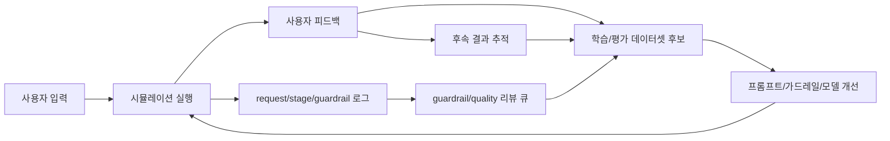

# 피드백/학습 데이터 확장 작업계획

- 작성일: 2026-05-10 16:55:15 KST
- 대상 프로젝트: `/Users/switch/Development/Web/life_simulator`
- 목적: 현재 Life Simulator의 입력, 중간 검증, A/B reasoning, 최종 추천, 사용자 반응, 후속 결과를 저장 가능한 제품 기능과 학습 데이터 루프로 확장한다.
- 후속 상세 구현안: `docs/refact/20260510-16-55-16-feedback-data-implementation-work-order.md`

## 1. 배경

현재 프로젝트는 사용자의 프로필, 고민 상황, A/B 선택지를 입력받고, 실행 모드에 따라 아래 흐름을 수행한다.

```text
state_loader -> planner -> scenario_a/b -> risk_a/b -> ab_reasoning -> guardrail -> advisor -> reflection
```

현재 Spring Boot 백엔드는 DB가 활성화되면 `life_simul_request_logs`, `life_simul_stage_logs`, `life_simul_guardrail_events`, `life_simul_anomaly_events`, `life_simul_eval_samples`에 실행 로그와 stage별 결과를 저장할 수 있다.

이미 저장되는 데이터는 아래 성격을 가진다.

- 원본 요청: `userProfile`, `decision`, `prior_memory`, `state_hints`, `reevaluation`
- 중간 결과: planner, scenario, risk, A/B reasoning
- 안전 평가: guardrail trigger, final mode, risk/confidence/uncertainty score
- 최종 결과: advisor decision, confidence, reason
- 자체 평가: reflection scores, guardrail review
- 운영 메타: model, prompt version, latency, token, fallback, cache, error

하지만 아직 사용자의 실제 반응과 실제 선택 결과를 저장하는 기능은 없다. 그래서 현재 로그만으로는 아래 질문에 답하기 어렵다.

- 사용자는 A reasoning, B reasoning, 최종 추천 중 무엇을 신뢰했는가?
- 사용자가 실제로 선택한 안은 추천안과 같았는가?
- 시간이 지난 뒤 만족/후회/예상 차이는 어땠는가?
- guardrail이 과도했는지, 부족했는지 사람이 어떻게 평가했는가?
- 어떤 프롬프트/모델/실행 경로가 사용자 동의율과 후속 만족도가 높은가?

이번 확장의 목표는 이 빈칸을 채우는 것이다.

## 2. 최종 목표

최종적으로 서비스는 아래 루프를 가져야 한다.



핵심은 단순히 좋아요 숫자를 모으는 것이 아니라, 추천 근거와 실제 선택 결과를 분리해 저장하는 것이다.

## 3. 제품 기능 범위

### 3.1 결과 카드별 피드백

첫 번째로 추가할 기능이다. 결과 화면에서 사용자는 각 판단 단위에 반응할 수 있어야 한다.

대상:

- A reasoning
- B reasoning
- A/B comparison
- final selection
- advisor final recommendation
- guardrail behavior
- reflection summary

수집 항목:

- 도움이 됐는가
- 동의하는가
- 실제 선택하고 싶은 안은 무엇인가
- 부족했던 정보 태그
- 선택적 코멘트

단순 `like/dislike`만 저장하지 않는다. 설명에 대한 선호, 결론에 대한 동의, 실제 선택 의향은 서로 다른 라벨이다.

### 3.2 실제 선택 및 후속 결과 추적

첫 실행 직후 피드백보다 더 가치 있는 데이터는 시간이 지난 뒤의 결과다.

초기 구현은 수동 입력으로 한다.

- 실제 선택: A, B, 보류, 다른 선택
- 만족도
- 후회 정도
- 예상과 달랐던 점
- 다음에는 더 반영해야 할 조건
- 추적 시점: 즉시, 7일, 30일, 90일

이 데이터는 나중에 `prior_memory.recent_similar_decisions`로 다시 연결할 수 있다. 단, 초기에 자동 장기 메모리 업데이트까지 강제하지 않는다.

### 3.3 상태 교정 피드백

state loader가 만든 사용자 상태가 틀렸거나 부족할 수 있다. 사용자는 아래 항목을 교정할 수 있어야 한다.

- 리스크 성향이 과대/과소 반영됨
- 재정 압박이 과대/과소 반영됨
- 시간 제약이 빠짐
- 감정 상태가 다르게 해석됨
- 장기 우선순위가 다르게 반영됨
- 과거 선택 패턴이 빠짐

교정 피드백은 모델 학습보다 먼저 state loader와 advisor prompt 개선에 직접 활용한다.

### 3.4 Guardrail 리뷰 큐

현재 anomaly와 eval sample 저장 구조가 있다. 여기에 사람 또는 운영자가 guardrail 판단을 리뷰할 수 있는 구조를 붙인다.

라벨:

- 적절
- 과도함
- 부족함
- 판단 불가

리뷰 대상:

- blocked인데 실제로는 추천 가능했는가?
- normal인데 사실 cautious/block이 필요했는가?
- low confidence 판단이 적절했는가?
- reasoning conflict 판단이 적절했는가?

### 3.5 프롬프트/모델 실험 비교

현재 로그에는 model, prompt_version, context_version, stage별 model 정보가 있다. 피드백 테이블을 붙이면 아래 지표를 비교할 수 있다.

- 최종 추천 동의율
- 실제 선택 일치율
- 후속 만족도
- 후회율
- guardrail over/missing 비율
- 단계별 fallback/error와 만족도 관계

초기 구현에서는 실험 UI까지 만들지 않는다. 데이터 구조와 조회 API가 prompt/model 비교를 가능하게 하면 충분하다.

## 4. Engine 경계 원칙

이번 확장은 단순한 앱 피드백 기능이 아니라, 향후 여러 도메인에서 공통으로 사용할 평가/학습 루프의 기반이다. 따라서 의미론은 engine에 두고, HTTP/DB 저장은 app adapter로 둔다.

### 4.1 Engine에 들어갈 책임

아래 책임은 Life Simulator UI에만 묶이지 않으므로 공통 engine 하위에 둔다.

- 평가 대상의 공통 모델
  - `reasoning_a`
  - `reasoning_b`
  - `comparison`
  - `final_selection`
  - `advisor`
  - `guardrail`
  - `reflection`
- 사용자 피드백 의미론
  - helpful / not helpful
  - agree / disagree
  - would choose
  - missing context
- 실제 결과 라벨
  - actual choice
  - satisfaction
  - regret
  - unexpected factors
- guardrail 리뷰 라벨
  - good / over / missing / unknown
- dataset candidate type
  - advisor preference
  - reasoning preference
  - guardrail label
  - state correction
  - outcome supervision
- request/stage log와 피드백/후속 결과/리뷰를 결합해 학습 후보를 만드는 규칙

권장 패키지:

```text
backend/src/main/java/com/lifesimulator/backend/engine/
  evaluation/
    DecisionEvaluationTarget.java
    FeedbackSignal.java
    OutcomeLabel.java
    GuardrailReviewLabel.java
    EvaluationEvent.java
    EvaluationLabelSet.java
  learning/
    DatasetCandidate.java
    DatasetCandidateBuilder.java
    DatasetCandidateType.java
    DatasetCandidateStatus.java
    DatasetCandidateBuildInput.java
  domain/
    life/
      evaluation/
        LifeEvaluationTargetMapper.java
        LifeFeedbackLabelMapper.java
```

### 4.2 App adapter에 남을 책임

아래 책임은 현재 웹앱, DB, 운영 환경에 묶여 있으므로 top-level app package에 둔다.

- `/api/feedback` Controller
- `/api/outcome-followups` Controller
- `/api/state-corrections` Controller
- `/api/guardrail-reviews` Controller
- `/api/learning/dataset-candidates/*` Controller
- DB insert/update Repository
- session id, trace id, request header 처리
- monitoring summary query
- worker 실행 entrypoint

권장 app 패키지:

```text
backend/src/main/java/com/lifesimulator/backend/
  feedback/
  outcome/
  correction/
  review/
  learning/
```

여기서 app `learning` 패키지는 HTTP/DB adapter만 담당한다. candidate 생성 의미론은 `engine/learning`의 builder를 호출한다.

### 4.3 Life 도메인 매핑

Life Simulator 응답 shape는 A/B 구조와 state context를 갖는다. 그러나 engine의 평가/학습 모델은 Life 전용 필드명을 직접 알면 안 된다.

따라서 Life 전용 매퍼가 아래 변환을 담당한다.

- `SimulationResponse.reasoning.reasoning.a_reasoning` -> `DecisionEvaluationTarget.REASONING_A`
- `SimulationResponse.reasoning.reasoning.b_reasoning` -> `DecisionEvaluationTarget.REASONING_B`
- `SimulationResponse.advisor` -> `DecisionEvaluationTarget.ADVISOR`
- `SimulationResponse.guardrail` -> `DecisionEvaluationTarget.GUARDRAIL`
- `SimulationResponse.reflection` -> `DecisionEvaluationTarget.REFLECTION`
- `decision.optionA`, `decision.optionB` -> engine option id `A`, `B`

이 분리를 지켜야 이후 다른 도메인이 들어와도 자기 mapper만 추가해서 같은 evaluation/learning engine을 사용할 수 있다.

## 5. 데이터 모델 확장 방향

### 5.1 신규 핵심 테이블

권장 신규 테이블:

- `life_simul_user_feedback`
- `life_simul_outcome_followups`
- `life_simul_state_corrections`
- `life_simul_guardrail_reviews`
- `life_simul_dataset_candidates`

각 테이블은 `request_id`, `trace_id`, `session_id`, `user_id`를 가능한 한 공통으로 가진다. 현재 인증 기능이 없으므로 `user_id`는 nullable로 유지하고, 초기 연결 키는 `request_id`와 `session_id`다.

### 5.2 피드백 이벤트

`life_simul_user_feedback`은 결과 카드별 이벤트를 저장한다.

핵심 필드:

- `feedback_id`
- `request_id`
- `trace_id`
- `session_id`
- `target_type`
- `target_option`
- `feedback_signal`
- `rating`
- `reason_tags`
- `comment`
- `metadata`
- `created_at`
- `updated_at`

`target_type` 예:

- `reasoning_a`
- `reasoning_b`
- `comparison`
- `final_selection`
- `advisor`
- `guardrail`
- `reflection`

`feedback_signal` 예:

- `helpful`
- `not_helpful`
- `agree`
- `disagree`
- `would_choose`
- `missing_context`

### 5.3 후속 결과

`life_simul_outcome_followups`는 시간이 지난 뒤 실제 선택과 결과를 저장한다.

핵심 필드:

- `followup_id`
- `request_id`
- `actual_choice`
- `satisfaction_score`
- `regret_score`
- `outcome_note`
- `unexpected_factors`
- `horizon_days`
- `metadata`
- `created_at`
- `updated_at`

### 5.4 상태 교정

`life_simul_state_corrections`는 사용자가 state loader의 해석을 고쳐주는 데이터를 저장한다.

핵심 필드:

- `correction_id`
- `request_id`
- `field_path`
- `original_value`
- `corrected_value`
- `correction_type`
- `comment`
- `created_at`

### 5.5 Guardrail 리뷰

`life_simul_guardrail_reviews`는 운영자 또는 사용자의 guardrail 판단 리뷰를 저장한다.

핵심 필드:

- `review_id`
- `request_id`
- `reviewer_type`
- `review_label`
- `correct_mode`
- `reason_tags`
- `comment`
- `created_at`

### 5.6 학습/평가 데이터셋 후보

`life_simul_dataset_candidates`는 원본 로그와 피드백/후속 결과/리뷰를 결합해 학습 또는 평가에 쓸 수 있는 후보를 저장한다. 후보 생성 규칙은 app repository가 아니라 `engine/learning/DatasetCandidateBuilder`가 담당한다.

핵심 필드:

- `candidate_id`
- `request_id`
- `candidate_type`
- `source`
- `input_payload`
- `expected_payload`
- `actual_payload`
- `label_payload`
- `quality_score`
- `status`
- `created_at`
- `updated_at`

초기에는 자동 학습이 아니라 `candidate`로만 모은다. 사람이 검토하거나 별도 worker가 `accepted` 상태로 바꾸는 구조를 둔다.

## 6. API 확장 방향

신규 API는 기존 `/api/simulate` 응답 shape를 건드리지 않고 별도 controller로 추가한다.

권장 엔드포인트:

- `POST /api/feedback`
- `PUT /api/feedback/{feedbackId}`
- `POST /api/outcome-followups`
- `PUT /api/outcome-followups/{followupId}`
- `POST /api/state-corrections`
- `POST /api/guardrail-reviews`
- `GET /api/learning/dataset-candidates`
- `POST /api/learning/dataset-candidates/build`
- `GET /api/learning/feedback-summary`

초기 UI에서 반드시 필요한 것은 `POST /api/feedback`, `POST /api/outcome-followups`다. 나머지는 운영/학습 루프를 위한 확장이다.

## 7. 프론트엔드 확장 방향

초기 UI 추가 대상:

- `AdvisorCard` 아래 동의/비동의/실제 선택 의향 버튼
- `ReasoningCard`의 A/B reasoning 별 도움됨/도움 안 됨 버튼
- `GuardrailCard`의 과도함/적절/부족함 피드백
- 결과 하단의 후속 결과 입력 패널

프론트 상태는 피드백 제출 완료 여부를 표시하되, 피드백 제출 실패가 시뮬레이션 결과 화면 자체를 깨뜨리면 안 된다.

## 8. 학습 활용 전략

초기에는 오픈소스 LLM을 바로 fine-tuning하지 않는다. 데이터 품질이 먼저다.

1. 피드백과 후속 결과를 충분히 모은다.
2. `dataset_candidates`로 정제한다.
3. 작은 분류/랭킹 모델 또는 rule tuning부터 시작한다.
4. 충분한 품질의 pair 데이터가 모이면 SFT 또는 DPO 데이터로 export한다.

권장 우선순위:

- guardrail classifier 개선
- advisor reranker 개선
- state loader correction 개선
- reasoning A/B 선호 패턴 분석
- 그 다음 오픈소스 LLM SFT/DPO

## 9. 개인정보와 운영 주의

현재 입력에는 직업, 나이, 고민 내용, 선택지, 자유 텍스트가 포함된다. 피드백과 후속 결과는 더 민감할 수 있다.

필수 원칙:

- UI에 데이터 저장 목적을 명확히 표시한다.
- 개인 식별 정보를 직접 요구하지 않는다.
- 학습 데이터 export 시 `session_id`, `user_id`, 자유 텍스트의 민감 정보 제거 옵션을 둔다.
- 운영 DB와 로컬 테스트 DB 모두 migration을 같은 방식으로 적용한다.
- 기존 데이터가 테스트용이라도 migration은 재실행 가능하고 idempotent하게 작성한다.

## 10. 단계별 구현 순서

### Phase 0: 브랜치와 기준 고정

- 새 브랜치 생성
- 현재 테스트 실행
- DB 활성화 기준 확인
- 기존 request/stage log insert 동작 확인

### Phase 1: DB migration 추가

- 피드백/후속 결과/교정/리뷰/dataset 후보 테이블 추가
- local DB migration 적용
- remote DB가 있으면 동일 migration 적용

### Phase 2: Engine evaluation/learning contract 추가

- `engine/evaluation` 공통 target, signal, label 모델 추가
- `engine/learning` dataset candidate 모델과 builder 추가
- `engine/domain/life/evaluation` Life 응답 -> 공통 evaluation target 매핑 추가
- 이 단계에서는 DB insert 없이 단위 테스트로 label/candidate 생성 의미론을 먼저 고정

### Phase 3: 백엔드 저장 API 추가

- feedback controller/service/repository 추가
- outcome followup controller/service/repository 추가
- update API까지 구현
- request_id 존재 여부와 session_id 연결 검증
- Service는 engine evaluation type을 사용하고, Repository는 DB row 변환만 담당

### Phase 4: dataset candidate persistence 추가

- request log, stage log, feedback, followup, review를 묶어 candidate 생성
- guardrail/reasoning/advisor 목적별 candidate type 분리
- worker 또는 API에서 build 실행 가능하게 구성
- 후보 생성은 `engine/learning/DatasetCandidateBuilder`가 수행하고, app `learning` 패키지는 조회/저장만 담당

### Phase 5: 프론트 UI 추가

- 결과 카드별 피드백 버튼
- 후속 결과 입력 패널
- 제출 상태와 오류 표시
- 기존 시뮬레이션 실행 UX 유지

### Phase 6: 모니터링 확장

- feedback summary API 추가
- 추천 동의율, 실제 선택 일치율, 후속 만족도 집계
- guardrail review summary 추가

### Phase 7: E2E 검증

- DB truncate 또는 재생성
- 시뮬레이션 실행
- feedback insert/update
- outcome followup insert/update
- dataset candidate 생성
- local/remote DB 모두 동일 테이블과 데이터 흐름 확인

## 11. 완료 기준

- 신규 테이블이 migration으로 생성된다.
- 로컬 DB와 remote DB가 모두 같은 스키마를 가진다.
- 결과 카드별 피드백이 DB에 insert된다.
- 피드백 수정이 DB에 update된다.
- 후속 결과가 DB에 insert/update된다.
- dataset candidate가 실제 request log와 피드백을 결합해 생성된다.
- 프론트에서 피드백 제출 실패가 결과 화면을 깨뜨리지 않는다.
- backend test가 통과한다.
- frontend typecheck/build가 통과한다.
- 구현 완료 후 모든 변경을 커밋하고 push한다.
