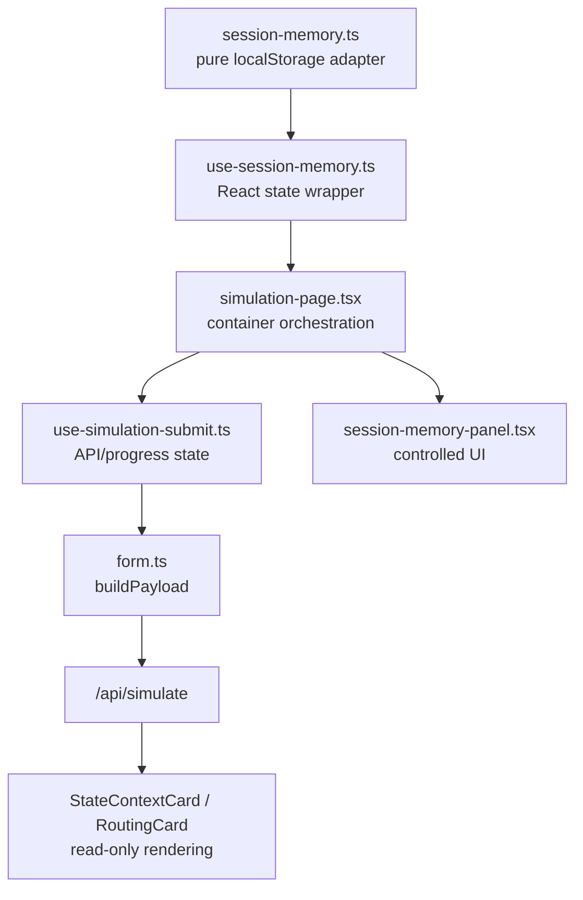

# 익명 세션 메모리 1차 개발계획

- 작성일: 2026-05-13 17:10:54 KST
- 대상 프로젝트: `/Users/switch/Development/Web/life_simulator`
- 목적: 회원가입 없이도 같은 브라우저 세션에서 최근 의사결정 기록을 저장하고, 다음 simulation 요청의 `prior_memory.recent_similar_decisions`로 주입한다.
- 범위: 프론트엔드 localStorage 기반 1차 구현

## 1. 배경

현재 `Memory State > Recent Similar Decisions`는 `stateContext.user_state.memory_state.recent_similar_decisions`를 렌더링한다.

백엔드는 요청에 `prior_memory.recent_similar_decisions`가 있으면 이를 state context에 반영한다. 하지만 현재 프론트의 simulation payload는 `userProfile`과 `decision`만 전송하므로, 일반 사용 흐름에서는 recent memory가 자동으로 채워지지 않는다.

이미 프론트에는 익명 세션 ID가 있다.

- `frontend/src/lib/api/session.ts`
- localStorage key: `life-simulator-session-id`
- `/api/simulate`, feedback, recommendation 요청에 `x-session-id`로 전달됨

따라서 1차 구현은 회원가입, DB, 계정 시스템 없이 같은 브라우저의 localStorage를 사용해 recent decision memory를 만든다.

## 2. 목표

사용자는 결과 화면에서 이번 의사결정을 명시적으로 저장할 수 있다.

저장된 기록은 다음 simulation 요청에 아래 형태로 들어간다.

```json
{
  "prior_memory": {
    "recent_similar_decisions": [
      {
        "topic": "커리어 이직 고민",
        "selected_option": "스타트업으로 이직한다",
        "outcome_note": "성장 가능성은 크지만 안정성 우려가 남았다"
      }
    ]
  }
}
```

다음 결과 화면에서는 `Recent Similar Decisions`에 유효한 기록이 표시된다. 유효한 기록이 없으면 `none`을 표시한다.

## 3. 비범위

1차에서는 아래를 하지 않는다.

- 회원가입, 로그인, 계정별 동기화
- 백엔드 DB에 메모리 저장
- 서버에서 `x-session-id`로 prior memory 자동 조회/주입
- 다른 기기/브라우저 간 메모리 공유
- AI 추천 결과를 자동으로 “사용자 선택”으로 저장
- 장기 outcome 추적 자동화

## 4. 핵심 제품 원칙

### 4.1 자동 저장하지 않는다

`selected_option`은 AI가 추천한 선택이 아니라 사용자가 실제로 선택했거나 기억하고 싶은 선택이어야 한다.

따라서 simulation 완료 직후 자동 저장하지 않는다. 결과 화면에서 사용자가 명시적으로 저장 버튼을 누를 때만 저장한다.

### 4.2 저장 전 필드 완성도를 강제한다

아래 세 필드는 모두 비어 있으면 안 된다.

- `topic`
- `selected_option`
- `outcome_note`

빈 필드가 있으면 localStorage에 저장하지 않는다.

### 4.3 사용자가 제어할 수 있어야 한다

1차에도 최소 제어 기능은 필요하다.

- 이번 결정 저장
- 저장된 세션 메모리 보기
- 개별 기록 삭제
- 전체 세션 메모리 초기화

## 5. 데이터 모델

프론트 localStorage에는 API payload와 분리된 wrapper 형태로 저장한다.

권장 key:

```text
life-simulator.session-memory.v1
```

권장 schema:

```ts
type SessionMemoryStore = {
  version: 1;
  updatedAt: string;
  decisions: SessionMemoryDecision[];
};

type SessionMemoryDecision = {
  id: string;
  createdAt: string;
  topic: string;
  selected_option: string;
  outcome_note: string;
  sourceRequestId?: string;
  sourceCaseId?: string;
};
```

simulation 요청에 넣을 때는 `MemoryDecisionRecord[]` 형태로 변환한다.

```ts
type MemoryDecisionRecord = {
  topic: string;
  selected_option: string;
  outcome_note: string;
};
```

## 6. 저장 정책

초기 정책:

- 최대 저장 개수: 10개
- payload 주입 개수: 최근 5개
- 보관 기간: 30일
- 정렬: `createdAt` 내림차순
- 중복 처리: `topic + selected_option + outcome_note`가 같으면 기존 기록 갱신 또는 최신 하나만 유지

만료되었거나 필드가 깨진 기록은 읽는 시점에 정리한다.

## 7. UX 계획

### 7.1 결과 화면 저장 패널

추천 위치:

- `StateContextCard` 아래 또는 `OutcomeFollowupPanel` 근처
- 사용자가 advisor 결과를 본 뒤 저장할 수 있는 위치

패널 이름 예시:

```text
Session Memory
```

컨트롤:

- 선택한 옵션: A / B / 보류 / 직접 입력
- 기억할 주제: 기본값은 현재 decision context 또는 planner decision_type 기반
- 메모: 사용자가 짧게 입력
- 저장 버튼
- 초기화 버튼

주의:

- “AI가 추천한 안 저장”처럼 보이면 안 된다.
- 문구는 “이번 선택을 이 브라우저에 기억” 정도로 제한한다.
- localStorage 기반임을 짧게 알린다.

### 7.2 Memory State 표시

이미 구현된 `Recent Similar Decisions` 필터링 정책은 유지한다.

- 유효한 항목만 표시
- 유효한 항목이 없으면 `none`
- `/ /` 같은 빈 구분자만 보이는 UI는 다시 생기면 안 된다.

## 8. 구현 대상 파일

예상 변경 파일:

```text
frontend/src/lib/session-memory.ts
frontend/src/lib/simulation/form.ts
frontend/src/hooks/use-session-memory.ts
frontend/src/hooks/use-simulation-submit.ts
frontend/src/components/simulation/session-memory-panel.tsx
frontend/src/components/simulation/simulation-page.tsx
frontend/src/components/simulation/overview-cards.tsx
frontend/src/lib/types.ts
```

## 8.1 역할 분리 원칙

1차 구현은 작지만, 아래 경계는 반드시 지킨다.

- storage 계층은 localStorage만 책임진다.
- payload builder는 request shape만 책임진다.
- submit hook은 API 실행 상태만 책임진다.
- page container는 storage와 submit을 조립한다.
- UI component는 props로 받은 값과 callback만 사용한다.
- rendering component는 응답 표시만 책임진다.

즉 `localStorage` 접근, request 생성, API 호출, UI 입력 상태, 결과 렌더링을 한 파일에 섞지 않는다.

## 8.2 파일별 책임

- `session-memory.ts`
  - localStorage read/write
  - schema migration/validation
  - max count, TTL, dedupe
  - `listRecentDecisionRecords()` 제공
  - React state, fetch, simulation submit 로직은 포함하지 않음
- `form.ts`
  - `buildPayload`가 optional prior memory를 받을 수 있게 확장
  - localStorage를 직접 읽지 않음
- `use-session-memory.ts`
  - React state와 `session-memory.ts`를 연결
  - 저장/삭제/초기화 후 화면 갱신
  - submit이나 fetch는 호출하지 않음
- `use-simulation-submit.ts`
  - simulation 실행, progress, error, versions 상태만 관리
  - `prior_memory`는 인자로 받은 request 옵션을 그대로 사용
  - localStorage를 직접 읽지 않음
- `session-memory-panel.tsx`
  - 저장/삭제/초기화 UI
  - 실제 저장은 사용자가 명시적으로 실행
  - localStorage 직접 접근 금지
  - API 호출 금지
- `simulation-page.tsx`
  - 결과 화면에 panel 배치
  - `useSessionMemory`와 `useSimulationSubmit`을 조립
  - submit 직전에 최근 memory record를 가져와 `submit`에 전달
- `overview-cards.tsx`
  - 기존 필터 유지
  - 필요하면 표시 문구만 미세 조정
  - memory 저장/삭제/수정 로직 추가 금지

## 8.3 권장 데이터 흐름



구현자는 위 방향의 의존성만 허용한다. 반대 방향 의존성은 만들지 않는다.

예:

- `session-memory.ts`가 React hook을 import하면 안 된다.
- `session-memory-panel.tsx`가 `runSimulation`을 import하면 안 된다.
- `use-simulation-submit.ts`가 `localStorage` 또는 `session-memory.ts`를 import하면 안 된다.
- `overview-cards.tsx`가 저장/삭제 함수를 import하면 안 된다.

## 8.4 권장 API 형태

`form.ts`:

```ts
type BuildPayloadOptions = {
  priorMemory?: Partial<MemoryState>;
};

function buildPayload(
  form: FormState,
  priorityCatalog?: PriorityCatalog | null,
  options?: BuildPayloadOptions,
): SimulationRequest;
```

`use-simulation-submit.ts`:

```ts
type SubmitOptions = {
  priorMemory?: Partial<MemoryState>;
};

submit(form, locale, priorityCatalog, options);
```

`simulation-page.tsx`:

```ts
const sessionMemory = useSessionMemory();

await submit(form, uiLocale, priorityCatalog, {
  priorMemory: sessionMemory.toPriorMemory(),
});
```

이 구조를 쓰면 submit 훅은 localStorage를 몰라도 되고, 이후 2차에서 백엔드 session memory로 바꿀 때도 page/container 조립부만 교체하면 된다.

## 9. 구현 순서

### 9.1 세션 메모리 유틸 작성

`frontend/src/lib/session-memory.ts`를 추가한다.

필수 함수:

```ts
listSessionMemoryDecisions(): SessionMemoryDecision[]
listRecentDecisionRecords(limit?: number): MemoryDecisionRecord[]
saveSessionMemoryDecision(input: SessionMemoryDecisionInput): SessionMemoryDecision
deleteSessionMemoryDecision(id: string): void
clearSessionMemory(): void
```

필수 방어:

- SSR 환경에서 안전하게 동작
- localStorage JSON parse 실패 시 빈 store로 복구
- 잘못된 record는 자동 제외
- 저장 전 trim

### 9.2 React hook 작성

`frontend/src/hooks/use-session-memory.ts`를 추가한다.

역할:

- `session-memory.ts`의 순수 함수를 React state로 감싼다.
- 저장/삭제/초기화 후 목록을 다시 읽어 화면을 갱신한다.
- `toPriorMemory()` 또는 `recentDecisionRecords`를 제공한다.

예상 반환 형태:

```ts
type UseSessionMemoryResult = {
  decisions: SessionMemoryDecision[];
  recentDecisionRecords: MemoryDecisionRecord[];
  saveDecision(input: SessionMemoryDecisionInput): SessionMemoryDecision;
  deleteDecision(id: string): void;
  clearDecisions(): void;
};
```

이 hook은 API 요청을 보내지 않는다.

### 9.3 simulation payload에 prior memory 주입

`simulation-page.tsx`가 `useSessionMemory`에서 recent records를 읽고, `submit`에 옵션으로 전달한다.

권장:

```ts
await submit(form, uiLocale, priorityCatalog, {
  priorMemory: {
    recent_similar_decisions: sessionMemory.recentDecisionRecords,
  },
});
```

`use-simulation-submit.ts`는 전달받은 옵션을 `buildPayload`에 넘긴다. 이 파일은 localStorage를 직접 읽지 않는다.

`buildPayload`는 유효한 기록이 없으면 `prior_memory`를 넣지 않는다.

### 9.4 저장 UI 추가

결과가 있을 때만 `SessionMemoryPanel`을 표시한다.

초기 입력값:

- `topic`: 현재 `result.planner.decision_type` 또는 `result.stateContext.state_summary.current_constraint`
- `selected_option`: A/B 선택 시 각각 `request.decision.optionA`, `request.decision.optionB`
- `outcome_note`: 사용자 입력 필수

저장 성공 후:

- 패널의 저장 목록 갱신
- “저장됨” 상태 표시
- 다음 simulation부터 반영된다는 점을 UI에서 짧게 안내

### 9.5 삭제/초기화 UI 추가

저장 목록에는 최근 기록을 간단히 보여준다.

각 항목:

- topic
- selected_option
- outcome_note
- 삭제 버튼

전체 초기화 버튼은 destructive action이므로 한 번 confirm을 둔다.

## 10. 테스트 계획

자동 검증:

```sh
cd frontend && npm run typecheck
cd frontend && npm run build
```

역할 분리 확인:

```sh
cd frontend
rg -n "localStorage|session-memory" src/hooks/use-simulation-submit.ts src/components/simulation/session-memory-panel.tsx src/components/simulation/overview-cards.tsx
rg -n "runSimulation|fetch\\(" src/components/simulation/session-memory-panel.tsx src/lib/session-memory.ts
```

위 명령은 의도하지 않은 의존성이 없는지 확인하는 용도다. 결과가 나오면 해당 import 또는 직접 호출이 역할 경계를 넘는 것인지 검토한다.

수동 검증:

1. localStorage가 빈 상태에서 simulation 실행
   - `Recent Similar Decisions`는 `none`
2. 결과 화면에서 A 또는 B 선택을 저장
   - localStorage에 `life-simulator.session-memory.v1` 생성
3. 다시 simulation 실행
   - request payload에 `prior_memory.recent_similar_decisions` 포함
   - 결과의 `Memory State`에 저장한 항목 표시
4. 빈 outcome note로 저장 시도
   - 저장되지 않음
5. 개별 삭제
   - 다음 실행 payload에서 제외
6. 전체 초기화
   - localStorage store 제거 또는 빈 store 처리
   - 다음 실행에서 `prior_memory` 제외

브라우저 확인:

- desktop 폭
- mobile 폭
- 긴 `outcome_note`가 카드 밖으로 넘치지 않는지

## 11. 배포 계획

1차는 프론트 전용 변경이므로 백엔드 재시작은 필요 없다.

배포 절차:

```sh
cd frontend && npm run typecheck
cd frontend && VITE_API_BASE_URL=https://ai-miracle.cloud npm run build
```

운영 반영:

- `frontend/dist`를 `/var/www/life-simulator`에 반영
- Nginx reload
- `https://ai-miracle.cloud/` smoke test
- `https://ai-miracle.cloud/api/cases` smoke test

## 12. 리스크와 대응

### 12.1 사용자가 localStorage 메모리를 실제 계정 저장으로 오해할 수 있음

대응:

- “이 브라우저에만 저장됩니다” 문구를 짧게 표시
- 초기화 버튼 제공

### 12.2 부정확한 사용 기록이 다음 판단을 오염시킬 수 있음

대응:

- 자동 저장 금지
- 사용자가 직접 선택/메모 입력
- 저장 목록 삭제 가능

### 12.3 민감 정보가 브라우저에 남을 수 있음

대응:

- 저장 문구에서 민감 정보 입력을 유도하지 않음
- 전체 초기화 제공
- 30일 TTL 적용

### 12.4 LLM이 prior memory를 과도하게 반영할 수 있음

대응:

- payload 주입은 최근 5개로 제한
- `outcome_note`는 짧은 summary 수준으로 유지
- 백엔드 prompt 개선은 2차 범위로 분리

## 13. 완료 기준

1차 완료 조건:

- 회원가입 없이 같은 브라우저에서 recent decision memory 저장 가능
- 다음 simulation request에 `prior_memory.recent_similar_decisions`가 자동 포함
- 유효하지 않은 memory record는 저장/렌더링되지 않음
- 사용자가 저장 기록을 삭제/초기화할 수 있음
- `npm run typecheck` 통과
- `npm run build` 통과
- 운영 배포 후 `/`, `/api/cases` smoke test 통과

## 14. 2차 승격 조건

아래 조건이 생기면 백엔드 세션 메모리 또는 계정 메모리로 확장한다.

- 여러 기기에서 동일 메모리를 이어 써야 함
- 사용자가 기록을 장기 보존하길 원함
- outcome follow-up과 recent memory를 자동 연결해야 함
- 운영자가 세션 단위 memory 품질을 분석해야 함
- 회원가입/로그인 기능이 도입됨

2차에서는 `x-session-id`를 이용해 백엔드 DB에서 session memory를 저장/조회하고, 로그인이 도입되면 session memory를 account memory로 migration하는 흐름을 설계한다.
