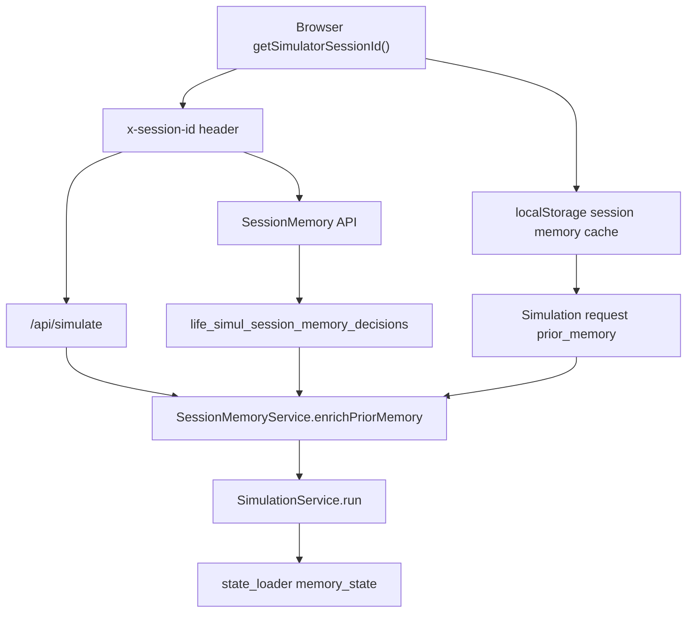

# Anonymous Session Memory DB Plan

## 목표

회원가입 없이 브라우저 단위 `session_id`를 기준으로 사용자가 저장한 결정 메모리를 백엔드 DB에도 저장한다.

현재 1차 구현은 `localStorage`에만 `recent_similar_decisions`를 저장하고, 다음 시뮬레이션 요청의 `prior_memory`로 보낸다. 2차 구현은 같은 데이터를 서버 DB에 저장하고, 시뮬레이션 실행 시 백엔드가 `x-session-id`로 DB 메모리를 조회해 `prior_memory`에 병합한다.

## 범위

- 익명 세션 메모리 CRUD API 추가
- 세션 메모리 DB 테이블과 Flyway migration 추가
- 프론트 세션 메모리 hook을 localStorage 전용에서 localStorage + API 동기화 구조로 확장
- `/api/simulate` 실행 전에 DB 메모리를 `prior_memory.recent_similar_decisions`에 병합
- 기존 localStorage UX는 유지하고 DB 실패 시 로컬 저장만으로 계속 사용 가능하게 처리
- request/stage log에 `session_id`가 실제로 저장되도록 보정

## 제외

- 회원가입, 로그인, 계정 통합
- 여러 브라우저 간 세션 병합
- 민감정보 암호화 저장
- 관리자용 세션 메모리 조회 화면
- LLM 프롬프트 스키마 변경

## 현재 진입점

- 프론트 session id: `frontend/src/lib/api/session.ts`
- 시뮬레이션 API 호출: `frontend/src/lib/api/simulation.ts`
- 로컬 세션 메모리 저장소: `frontend/src/lib/session-memory.ts`
- 세션 메모리 hook: `frontend/src/hooks/use-session-memory.ts`
- 세션 메모리 UI: `frontend/src/components/simulation/session-memory-panel.tsx`
- 시뮬레이션 페이지 orchestration: `frontend/src/components/simulation/simulation-page.tsx`
- 백엔드 시뮬레이션 컨트롤러: `backend/src/main/java/com/lifesimulator/backend/api/SimulationController.java`
- DB 설정/migration runner: `backend/src/main/java/com/lifesimulator/backend/database/*`
- 기존 migration: `backend/src/main/resources/db/migration/*`

## 역할 분리

### Backend

- `SessionIdResolver`
  - `x-session-id` 파싱, trim, 길이 제한, blank 처리만 담당
  - 컨트롤러마다 중복된 session id 파싱을 점진적으로 제거

- `SessionMemoryController`
  - HTTP contract 담당
  - `GET /api/session-memory/decisions`
  - `POST /api/session-memory/decisions`
  - `DELETE /api/session-memory/decisions/{memoryId}`
  - `DELETE /api/session-memory/decisions`
  - 저장/조회 정책은 서비스로 위임

- `SessionMemoryService`
  - session id 단위 검증
  - 저장 record normalize, dedupe, TTL 정책
  - `recent_similar_decisions` 조회
  - simulation request에 DB 메모리 병합
  - DB disabled 또는 repository 실패 시 simulation은 실패시키지 않고 best-effort로 동작

- `SessionMemoryRepository`
  - `JdbcTemplate` SQL만 담당
  - insert/upsert/list/delete/clear
  - `@ConditionalOnProperty(prefix = "simulator.database", name = "enabled", havingValue = "true")`

- `SimulationController`
  - session id를 한 번만 resolve
  - rate limit에 같은 session id 사용
  - simulation 실행 전 `SessionMemoryService.enrichPriorMemory(body, sessionId)` 호출
  - 스트리밍/non-streaming 경로 모두 동일하게 적용

- `SimulationExecutionEnvelope`, `SimulationStageLog`, `SimulationEnvelopeFactory`, `SimulationLogRepository`
  - existing DB schema의 `session_id` 컬럼에 실제 값을 넣도록 보정
  - logging side effect는 유지

### Frontend

- `frontend/src/lib/api/session-memory.ts`
  - 세션 메모리 API client만 담당
  - 항상 `x-session-id: getSimulatorSessionId()` 포함

- `frontend/src/lib/session-memory.ts`
  - localStorage cache만 담당
  - API 호출 금지
  - 서버 record로 local cache를 교체/병합하는 함수 추가

- `frontend/src/hooks/use-session-memory.ts`
  - local cache 즉시 표시
  - mount 시 서버 메모리 fetch 후 local cache와 병합
  - save/delete/clear는 optimistic local update 후 API sync
  - `isSyncing`, `syncError`, `storageMode` 같은 UI 상태 제공

- `SessionMemoryPanel`
  - controlled UI만 담당
  - 저장/삭제/초기화 이벤트 emit
  - API/localStorage import 금지

- `simulation-page.tsx`
  - hook wiring만 담당
  - 시뮬레이션 요청에는 기존처럼 local `priorMemory`를 넣되, 백엔드도 DB에서 병합하므로 이중 안전망으로 동작

## 데이터 흐름



## API 계약

### `GET /api/session-memory/decisions`

Headers:

```http
x-session-id: <anonymous-session-id>
```

Response:

```json
{
  "decisions": [
    {
      "id": "mem_...",
      "createdAt": "2026-05-13T09:00:00Z",
      "topic": "커리어",
      "selected_option": "스타트업 이직",
      "outcome_note": "성장 기대가 더 컸음",
      "sourceRequestId": "request-...",
      "sourceCaseId": "career-..."
    }
  ]
}
```

### `POST /api/session-memory/decisions`

Request:

```json
{
  "id": "optional-client-generated-id",
  "topic": "커리어",
  "selected_option": "스타트업 이직",
  "outcome_note": "성장 기대가 더 컸음",
  "sourceRequestId": "request-...",
  "sourceCaseId": "career-..."
}
```

Behavior:

- 필수 필드 trim 후 blank면 `400`
- 같은 session에서 `topic + selected_option + outcome_note` dedupe
- 중복이면 기존 row update 후 최신순으로 올림
- 저장 후 해당 decision 반환

### `DELETE /api/session-memory/decisions/{memoryId}`

- 같은 `session_id` 소유 row만 삭제
- 없는 row는 idempotent하게 `204`

### `DELETE /api/session-memory/decisions`

- 해당 `session_id` 전체 삭제
- localStorage clear와 같은 의미

## DB 설계

Migration: `backend/src/main/resources/db/migration/V4__add_session_memory_decisions.sql`

```sql
CREATE TABLE IF NOT EXISTS life_simul_session_memory_decisions (
  id BIGSERIAL PRIMARY KEY,
  memory_id TEXT NOT NULL UNIQUE,
  session_id TEXT NOT NULL,
  dedupe_key TEXT NOT NULL,
  topic TEXT NOT NULL,
  selected_option TEXT NOT NULL,
  outcome_note TEXT NOT NULL,
  source_request_id TEXT,
  source_case_id TEXT,
  metadata JSONB NOT NULL DEFAULT '{}'::jsonb,
  expires_at TIMESTAMPTZ,
  created_at TIMESTAMPTZ NOT NULL DEFAULT NOW(),
  updated_at TIMESTAMPTZ NOT NULL DEFAULT NOW()
);

CREATE UNIQUE INDEX IF NOT EXISTS idx_life_simul_session_memory_dedupe
  ON life_simul_session_memory_decisions (session_id, dedupe_key);

CREATE INDEX IF NOT EXISTS idx_life_simul_session_memory_session_created
  ON life_simul_session_memory_decisions (session_id, created_at DESC);

CREATE INDEX IF NOT EXISTS idx_life_simul_session_memory_expires_at
  ON life_simul_session_memory_decisions (expires_at);
```

Notes:

- `source_request_id`는 FK로 묶지 않는다. DB disabled/local fallback 또는 로그 삭제 상황에서도 메모리 저장이 깨지지 않아야 한다.
- `dedupe_key`는 backend에서 trim/lowercase 기반으로 계산한다.
- TTL 기본값은 30일로 localStorage 정책과 맞춘다.

## 설정

`application.yml`에 `simulator.session-memory` 추가:

```yaml
simulator:
  session-memory:
    enabled: ${SIMULATOR_SESSION_MEMORY_ENABLED:true}
    max-stored-decisions: ${SIMULATOR_SESSION_MEMORY_MAX_STORED_DECISIONS:10}
    prior-memory-limit: ${SIMULATOR_SESSION_MEMORY_PRIOR_MEMORY_LIMIT:5}
    ttl: ${SIMULATOR_SESSION_MEMORY_TTL:30d}
```

`backend/.env.example`에도 같은 기본값을 추가한다.

## 병합 정책

시뮬레이션 요청 직전:

1. request body의 `prior_memory.recent_similar_decisions`를 읽는다.
2. DB에서 `session_id` 기준 최신 decision을 `prior-memory-limit`보다 넉넉하게 조회한다.
3. client memory와 DB memory를 합친다.
4. `topic + selected_option + outcome_note` 기준으로 dedupe한다.
5. 최대 5개로 자른다.
6. 최종 request의 `prior_memory.recent_similar_decisions`에 넣는다.

우선순위:

- client memory를 먼저 둔다. 사용자가 방금 저장했지만 API sync가 실패했거나 지연된 경우를 보완하기 위해서다.
- DB memory는 그 뒤에 붙인다.
- blank field가 있는 record는 제외한다.

## 구현 순서

1. Backend DB migration
   - `V4__add_session_memory_decisions.sql` 추가
   - table, indexes 작성

2. Backend domain/API skeleton
   - `memory` 패키지 추가
   - request/response record 추가
   - repository/service/controller 추가
   - session id resolver 추가

3. Backend prior memory enrichment
   - `SessionMemoryService.enrichPriorMemory(JsonNode, String)` 추가
   - `SimulationController` stream/non-stream 경로에 적용
   - rate limit과 같은 normalized session id 사용

4. Backend logging session id 보정
   - `DecisionEngineRequest` 또는 `SimulationService.run` 경로에 session id 전달
   - `SimulationExecutionEnvelope`, `SimulationStageLog`에 sessionId 필드 추가
   - request/stage/guardrail/anomaly insert SQL에 `session_id` 포함

5. Frontend API client
   - `frontend/src/lib/api/session-memory.ts` 추가
   - list/save/delete/clear 함수 작성
   - `x-session-id` 공통 적용

6. Frontend local cache 확장
   - 서버 record와 local record의 id/createdAt/source fields를 동일 shape로 맞춤
   - `replaceSessionMemoryDecisions` 또는 `mergeSessionMemoryDecisions` 추가
   - localStorage TTL/dedupe 정책은 유지

7. Frontend hook sync
   - mount 시 `GET /api/session-memory/decisions`
   - save 시 optimistic local 저장 후 `POST`
   - delete/clear 시 optimistic local update 후 API
   - 실패 시 local-only 상태 메시지 유지

8. UI 상태 반영
   - `SessionMemoryPanel`에 sync 상태 props 추가
   - “DB 동기화됨”, “로컬 저장만 사용 중” 수준의 짧은 상태만 표시
   - 패널이 API를 직접 알지 않게 유지

9. Tests
   - backend service merge/dedupe/TTL 단위 테스트
   - controller contract 테스트
   - simulation controller가 `prior_memory`를 enrich해서 service에 넘기는 테스트
   - frontend typecheck/build

10. Rollout
   - 로컬 DB enabled로 migration 확인
   - 운영 배포 후 `GET/POST/DELETE /api/session-memory/decisions` smoke
   - 실제 UI 저장 후 다음 simulation에서 `Memory State > Recent Similar Decisions` 반영 확인

## 검증 목록

Backend:

```sh
cd backend && ./mvnw test
```

Frontend:

```sh
cd frontend && npm run typecheck
cd frontend && npm run build
```

DB/migration local smoke:

```sh
cd backend
BACKEND_DATABASE_ENABLED=true BACKEND_DATABASE_MIGRATE=true ./mvnw spring-boot:run
```

API smoke:

```sh
curl -X POST http://127.0.0.1:8080/api/session-memory/decisions \
  -H 'content-type: application/json' \
  -H 'x-session-id: smoke-session' \
  -d '{"topic":"career","selected_option":"A","outcome_note":"ok"}'

curl http://127.0.0.1:8080/api/session-memory/decisions \
  -H 'x-session-id: smoke-session'
```

Operating smoke:

- 운영 UI에서 저장
- 새로고침 후 저장 목록 유지
- 다음 시뮬레이션에서 `Recent Similar Decisions` 표시
- 전체 초기화 후 DB/API 목록과 UI 목록 모두 empty

## 수용 기준

- 회원가입 없이 같은 브라우저에서는 새로고침 후에도 DB 기반 세션 메모리가 복원된다.
- `localStorage`가 사용 가능하면 API 실패 시에도 기존 로컬 메모리 UX가 깨지지 않는다.
- DB가 enabled인 운영 환경에서는 저장된 세션 메모리가 다음 `/api/simulate` 요청의 `prior_memory.recent_similar_decisions`에 반영된다.
- 빈 recent decision은 기존처럼 렌더링되지 않고 `none` 처리된다.
- 저장/삭제/초기화는 session id 범위 밖의 데이터를 건드리지 않는다.
- 기존 feedback/outcome/recommendation API의 `x-session-id` 동작은 변경되지 않는다.

## 리스크와 대응

- `session_id`가 localStorage에 있으므로 사용자가 브라우저 데이터를 지우면 DB row가 있어도 다시 연결되지 않는다.
  - 회원가입 전 단계에서는 허용한다.

- DB 장애가 simulation 실패로 번질 수 있다.
  - memory enrichment는 best-effort로 처리하고, 실패 시 client-provided `prior_memory`만 사용한다.

- localStorage와 DB id가 달라지면 delete sync가 꼬일 수 있다.
  - frontend가 생성한 id를 `POST`에 보내고, backend가 반환한 canonical id로 local cache를 reconcile한다.

- 저장 메모리가 장기 누적될 수 있다.
  - TTL 30일, max 10개, clear API, expires index를 둔다.

- 운영 DB migration은 되돌리기 어렵다.
  - 신규 테이블만 추가하고 기존 테이블/컬럼은 삭제하지 않는다.
